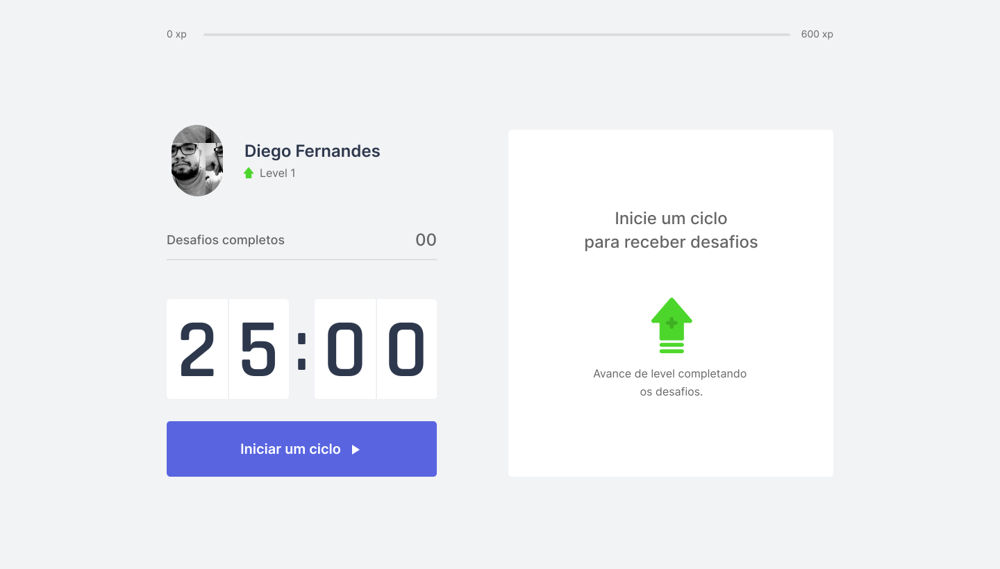

<h2 align="center">
  
</h2>
  
<p align="center">
  

  
  	
  <a href="https://www.linkedin.com/in/wesleyisrael/">
    
  </a>
	  
  <a href="https://github.com/WesleyIsr4/Move-it/commits/master">
    
  </a>

  
  
  <a href="https://github.com/WesleyIsr4/Move-it/stargazers">
    
  </a>
</p>

<h2 align="center">
  
</h2>

## 📝 Conteúdo

<p align="center">
<a href="#about">Sobre</a>&nbsp;&nbsp;&nbsp;|&nbsp;&nbsp;&nbsp;
<a href="#getting_started">Iniciando</a>&nbsp;&nbsp;&nbsp;|&nbsp;&nbsp;&nbsp;
<a href="#built_using">Tecnologias Utilizadas</a>&nbsp;&nbsp;&nbsp;|&nbsp;&nbsp;&nbsp;
<a href="#contribute">Como contribuir</a>&nbsp;&nbsp;&nbsp;|&nbsp;&nbsp;&nbsp;
</p>

## 🧐 Sobre <a name = "about"></a>

Move.it é uma Aplicação feita durante a **NWL 4.0** oferecido pela [Rocketseat] :rocket:.<br/>
A aplicação visa ajudar pessoas que ficam muito tempo na frente do computador e se esquecem de tempo em tempo
se alongar. Usando do método de Pomodoro, lembrando o usuário a cada período de tempo realizar uma atividade
que ao ser realizada, o usuário ganha experiência, subindo seu level<br/>

<span align="center">
	<h2>Demo</h2>
  <a href="https://moveit-next-75jplvub0-wesleyisr4.vercel.app/">Link</a>
</span>

## 🏁 Iniciando <a name = "getting_started"></a>

Instruções de como instalar a aplicação na sua máquina.

### ⚒ Instalando <a name = "installing"></a>

```
# 💻 Iniciando

$ cd web
$ yarn install
$ yarn start

```

## ⛏️ Tecnologias Utilizadas <a name = "built_using"></a>

As seguintes ferramentas foram usadas na construção do projeto:

- 🔵 [TypeScript][typescript]
- ⚛️ [React][reactjs]
- 🔼 [NextJs][next]
- 💅 [Styled-components][styled-components]

## ⚒ Futuras features

- [Leaderboards]
- [Dashboard]
- [Compartilhar]

## 🤔 Como contribuir <a name = "contribute"></a>

- Faça um fork desse repositório;
- Cria uma branch com a sua feature: `git checkout -b minha-feature`;
- Faça commit das suas alterações: `git commit -m 'feat: Minha nova feature'`;
- Faça push para a sua branch: `git push origin minha-feature`.

Feito com ❤️ por Wesley Israel 👋 [Entre em contato!](https://www.linkedin.com/in/wesleyisrael)

[next]: https://nextjs.org/
[typescript]: https://www.typescriptlang.org/
[reactjs]: https://reactjs.org
[rocketseat]: https://github.com/Rocketseat
[styled-components]: https://styled-components.com/
